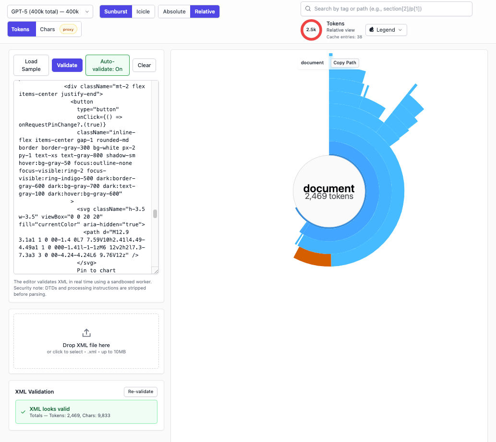
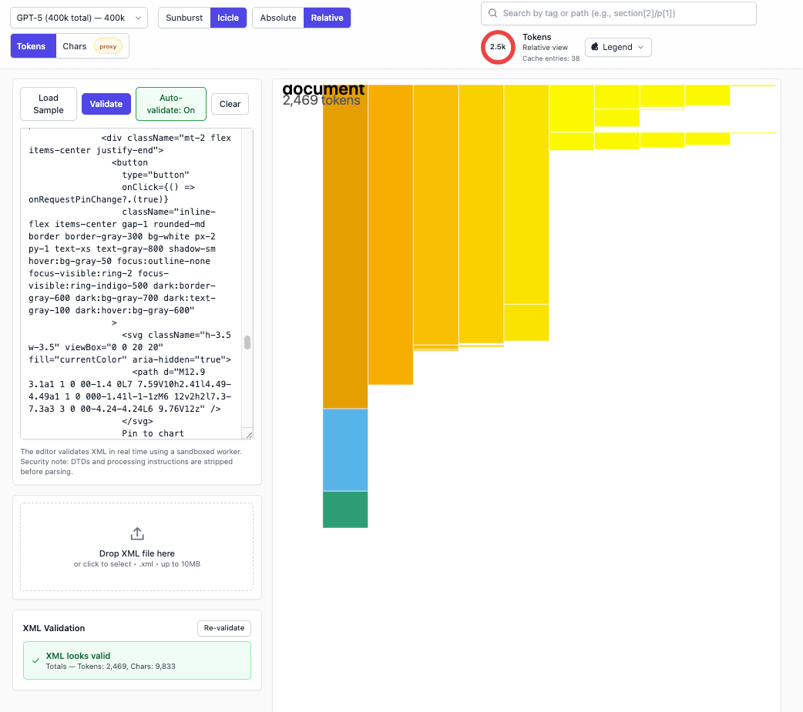

# DaisyPrompt — Interactive XML Prompt Visualizer

DaisyPrompt is a client-only React application that parses XML prompts, tokenizes content for selected LLM models, and creates beautiful interactive visualizations to help you understand and optimize your prompt structure.

**Workflow:** Input → Parse → Tokenize → Transform → Visualize




## ✨ Features

### Core Functionality
- **Dual Visualization Modes**: Interactive D3-powered sunburst and icicle charts
- **Semantic Color Coding**: Automatic color-coding for RepoPrompt XML elements (files, instructions, meta prompts, codemaps, file trees, etc.)
- **Real-time Token Counting**: Accurate tokenization for GPT-5, Claude Opus/Sonnet, and Gemini models
- **Web Worker Processing**: Non-blocking XML parsing and tokenization for smooth performance
- **Progressive Updates**: Responsive UI with streaming token count updates

### Interactive Features
- 🔍 **Search**: Find elements by tag name or path
- 🎨 **Color Legend**: Interactive legend explaining semantic colors (can be pinned to chart)
- 📊 **Size Basis Toggle**: Switch between token and character-based sizing
- 🔄 **Model Switching**: Compare token counts across different LLM models
- 🎯 **Zoom & Navigation**: Click to zoom into nodes, with breadcrumb trail navigation
- ⌨️ **Keyboard Support**: Full keyboard navigation for accessibility

### Performance Optimizations
- **Smart Aggregation**: Groups tiny slices into "Other (n items)" for cleaner visualization
- **Level of Detail (LOD)**: Limits visible nodes and depth for large XML files
- **Token Caching**: Reuses calculations when switching between models
- **Hash-based Deduplication**: Efficient processing of repeated content

## 🚀 Getting Started

### Prerequisites
- Node.js v20 LTS (recommended)
- npm, pnpm, or yarn

### Installation

```bash
# Clone the repository
git clone https://github.com/yourusername/daisyprompt.git
cd daisyprompt

# Install dependencies
npm install
```

### Development

```bash
# Start development server (opens on http://localhost:5173)
npm run dev

# Run type checking
npm run typecheck

# Format code
npm run format
```

### Production Build

```bash
# Build for production
npm run build

# Preview production build locally
npm run preview
```

## 📁 Project Structure

```
src/
├── pages/
│   └── Home.tsx              # Main page orchestration
├── components/
│   ├── input/               # XML input components
│   │   ├── XMLEditor        # Text editor for XML
│   │   ├── FileDrop         # Drag & drop file input
│   │   └── ValidationPanel  # Error display
│   ├── controls/            # UI controls
│   │   ├── ModelSelector    # LLM model selection
│   │   ├── ViewModeToggle   # Sunburst/Icicle switch
│   │   ├── SizeBasisToggle  # Token/Char sizing
│   │   ├── TokenDisplay     # Usage indicator
│   │   ├── SearchBox        # Element search
│   │   └── SemanticLegend   # Color legend
│   └── viz/                 # Visualization components
│       ├── SunburstChart    # Sunburst visualization
│       ├── IcicleChart      # Icicle visualization
│       ├── useSunburstD3    # D3 sunburst hook
│       ├── useIcicleD3      # D3 icicle hook
│       └── Breadcrumbs      # Navigation trail
├── state/
│   └── useStore.ts          # Zustand state management
├── utils/
│   ├── semantic.ts          # Semantic classification
│   ├── tokenizers.ts        # Model-specific adapters
│   ├── treeTransforms.ts    # Tree data processing
│   └── hashing.ts           # Content hashing
├── workers/
│   ├── parser.worker.ts     # XML parsing worker
│   └── tokenize.worker.ts   # Token counting worker
└── types/
    └── models.ts            # TypeScript definitions
```

## 🎨 How It Works

### 1. **Input Phase**
Users can paste XML directly or drag & drop XML files. The parser worker sanitizes input (removes DTDs and processing instructions) and builds a tree structure with character counts and stable hashes for each node.

### 2. **Parse Phase**
The application receives parsing progress updates and constructs an initial tree (`XmlNodeMeta`) with nodes sized by character count as a quick preview.

### 3. **Tokenize Phase**
Upon parse completion (or model change), the tokenizer worker traverses the tree breadth-first, counting tokens using model-specific adapters:
- **GPT-5**: Uses OpenAI's o200k_base tokenizer
- **Claude Models**: Claude-specific tokenizer adapter
- **Gemini**: Gemini tokenizer adapter

Partial updates stream every ~16ms, allowing the UI to progressively update the visualization.

### 4. **Transform Phase**
The raw `XmlNodeMeta` tree is transformed into a visualization-ready `PromptNode` structure with:
- Semantic type classification for RepoPrompt elements
- Aggregation of small siblings into "Other" nodes
- Level-of-detail constraints (max visible nodes and depth)
- Escaped preview text for tooltips
- Accumulated token and character totals

### 5. **Visualize Phase**
The transformed tree renders as either:
- **Sunburst Chart**: Radial hierarchy with clickable zoom
- **Icicle Chart**: Rectangular hierarchy with horizontal layers

Both support semantic coloring, interactive tooltips, breadcrumb navigation, and keyboard accessibility.

## 🔐 Security

- **Sandboxed Processing**: All XML parsing and tokenization runs in Web Workers
- **Input Sanitization**: DTDs and processing instructions are automatically removed
- **Safe Display**: All content previews are properly escaped before rendering
- **Client-Only**: No data is sent to external servers

## 📝 Notes

- **Token Approximation**: While precise token counts are being calculated, the UI shows character-based approximations with a "proxy" badge
- **Smart Caching**: Switching between models reuses cached calculations for identical content
- **Semantic Colors**: The application uses the Okabe-Ito colorblind-safe palette for accessibility

## 🤝 Contributing

Contributions are welcome! Please feel free to submit issues and pull requests.

## 📄 License

MIT